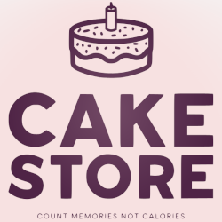

    

<h1 align="center">Cake Store Client/Server System</h1>

As a viable and reasonable case idea for the second semester project, undertaking *Software Technology Engineering* programme at VIA University College, the *Cake Store System* depicts separately a client and server side GUI application written in Java and JavaFX alongside with a PostgreSQL database for back end storage. The terse context of the case idea is to create a system which would allow the customers of an abstract made-up cake bakery view a catalog of available products, easily place any orders and receive notifications within the application itself.

# Educational Purpose of the Project
The project's purpose is to develop and document a client/server system as well as demonstrate the acquisition of process skills.

# Skills and Competences
During project development students learn and demonstrate the following abilities:
* Use an iterative system development method when executing a software project.
* Execute effective literature searching, in order to judge validity and reliability.
* Document the Analysis and Design of a software system using UML.
* Capture and formulate the requirements, both functional and non-functional, of a software system.
* Design a normalized relational database for data persistence, based on the preliminary analysis.
* Use SCRUM to control the development process of a software project.
* Use Unified Process as a system development method.
* Construct a project report in a well-structured manner, using provided templates.
* Describe a project execution in a process report.
* Conduct and execute a software project in collaboration with group members.
* Perform unit testing and use case testing based on the requirements and code of a software system.
* Implement a client-server software system in Java according to the system’s design.
* Implement a relational database as part of a client-server system according to the system’s design.
* Apply theory of database normalization that will result in a relational database on 3rd normal form.
* Capture requirements, analyse, design, implement and test a client/server system using UML, Java and SQL.
* Create and argue for a design that supports team collaboration of implementation, testing and execution with a clear connection between requirements, analysis, design, implementation, test and documentation.
* Create a small, robust, concurrent client/server system with the proper selection of design patterns and database-persistence to achieve a maintainable and flexible architecture.
* Black Box and White Box testing of a software system using relevant testing techniques.
* Apply relevant design principles including SOLID principles so that the resulting software system is maintainable, flexible and robust.
* Reflect upon chosen technical solutions of the software system for example their choice of design patterns.

# References
> The complete course description is documented thoroughly and can be found on the subsequent [page](https://en.via.dk/tmh-courses/semester-project-clientserver-system?education=ict).